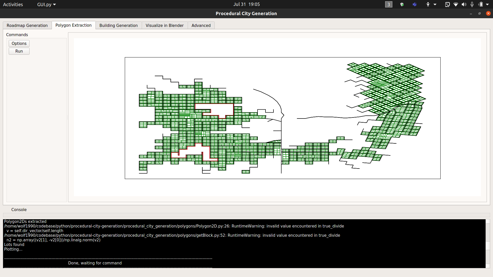
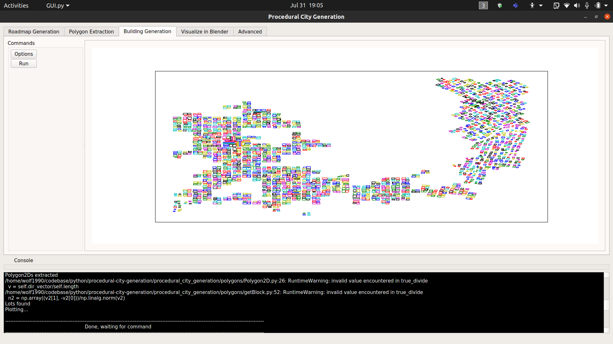
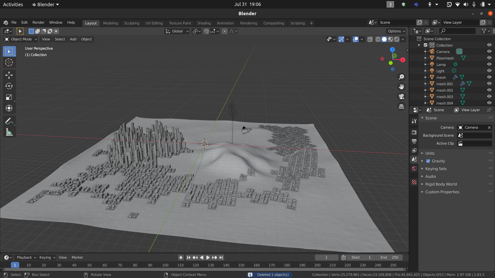

# Procedural City Generation

This is fork from [Procedural City Generation](https://github.com/josauder/procedural_city_generation). All credits go to by [josauder](https://github.com/josauder). Documentation can be found [here](http://josauder.github.io/procedural_city_generation).

#### Kindly open issues if you encounter bugs / need fixes.

---

## Dependencies

- pyqt5
- numpy
- matplotlib
- json
- pickle
- PIL
- scipy
- importlib
- pkgutil

## Running the program

> `python3 GUI.py`

